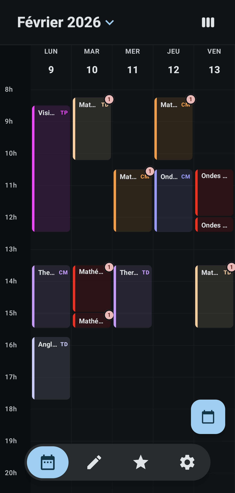
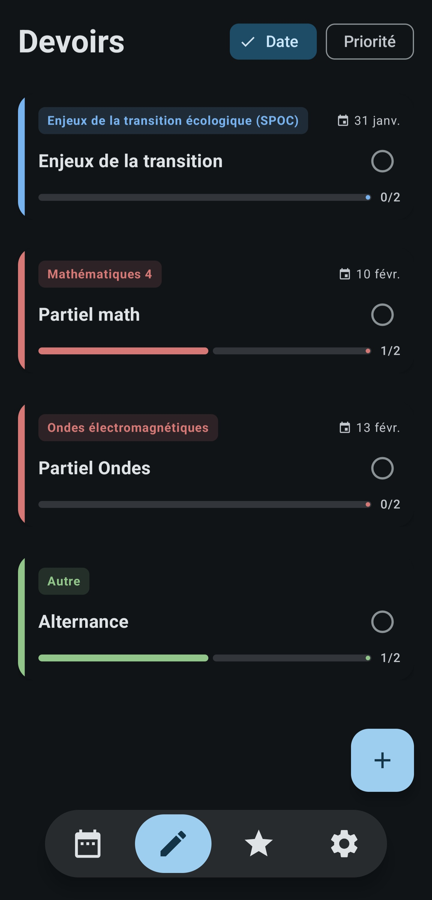
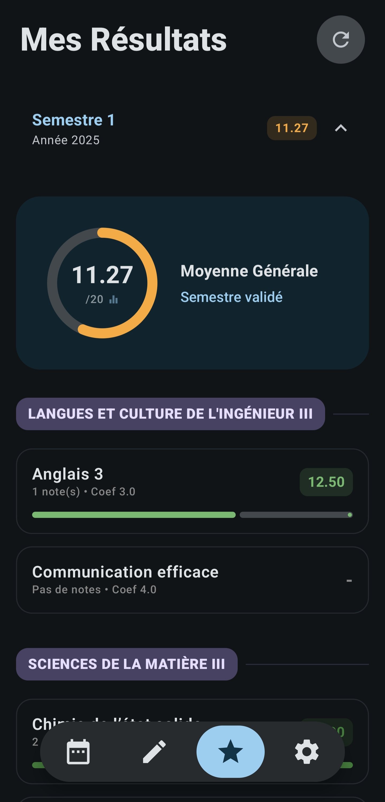

# PolySpace-app
**The all-in-one academic hub to simplify your student life in Polytech Paris-Saclay.**

PolySpace centralizes everything you need for your daily studies—Timetable, Homework, and Grades—into a single, sleek Android application. No more jumping between three different portals.

---

## Key Features

* **Unified Timetable:** Real-time schedule integration powered by a custom REST API.
* **Homework Tracker:** Manage your assignments locally with a robust **Room database** for offline access.
* **Grade Monitoring:** Automatic synchronization of academic results through advanced **HTML scraping**.
* **Modern UI:** Built with **Jetpack Compose** for a smooth and reactive user experience.

##  Technical Stack & Architecture

PolySpace is built with modern Android standards to ensure maintainability and performance:

* **Language:** Kotlin
* **UI Framework:** Jetpack Compose
* **Local Persistence:** Room Database (for Homework)
* **Data Fetching:** Custom API Integration (Retrofit/OkHttp)
    * HTML Scraping for Grades (Jsoup)
* **Architecture:** MVVM (Model-View-ViewModel) with a **Repository Pattern** to decouple data sources from the UI.


---

##  Getting Started

### Prerequisites
* Android Studio Ladybug or newer
* JDK 17+
* Android SDK 34+

### Installation
1.  **Clone the repository**:
    ```bash
    git clone git@github.com:MR06-101220/PolySpace-app.git
    ```
2.  **Open in Android Studio** and let Gradle sync.
3.  **Run on your device/emulator.**

---

## Screenshots
| Timetable | Homework | Grades |
| :---: | :---: | :---: |
|  |  |  |

---

## Legal Disclaimer & Credits

PolySpace is an independent, student-led project. It is **not affiliated with, endorsed by, or supported by any academic institution** or the developers of the Oasis portal.

* **Data Privacy:** Privacy is a priority. All scraped data, credentials, and homework are stored **locally** on your device's Room database. No personal data is ever sent to external servers.
* **API:** Timetable data is powered by the custom API developed by [lekawik](https://github.com/lekawik).
* **Scraping & Maintenance:** The grading module uses HTML parsing to fetch data from the Oasis portal. As this is not an official API, this feature may break or require updates if the portal's structure changes.
* **Educational Purpose:** This application is intended for personal and educational use only. Users are responsible for complying with their institution's Terms of Service regarding automated access to portal data.
